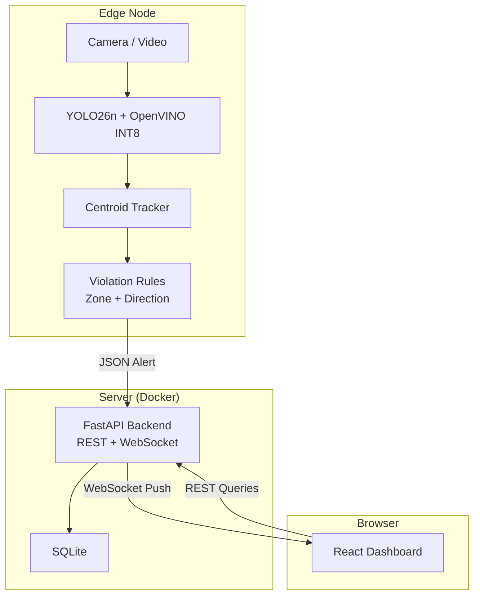

# Edge-First Smart Traffic Violation System

> **Edge AI** • YOLO26n • OpenVINO INT8 • FastAPI • React • Docker

An edge-first architecture for smart traffic violation detection. Intelligence runs on-camera/on-node — the system processes video locally using YOLO26n quantized to INT8 via OpenVINO, detects violations (Wrong Way, Illegal Parking), and transmits only lightweight JSON alerts to a React dashboard.

**Key Value Proposition:**
- 🚀 **99% bandwidth reduction** — Only JSON alerts leave the edge node, not raw video
- 🔒 **Privacy-first** — Faces and plates are never stored; only violation metadata persists
- ⚡ **Real-time on CPU** — 30+ FPS on Intel CPUs via OpenVINO INT8 quantization
- 🏙️ **Smart City Ready** — Designed for UAE/GCC deployments (NEOM, Dubai RTA, Abu Dhabi DMT)

---

## Architecture



> 📘 See [docs/ARCHITECTURE.md](docs/ARCHITECTURE.md) for detailed system design and data flow.

---

## Quick Start

### Prerequisites

- **Python 3.11+**
- **Node.js 20+**
- **Docker & Docker Compose** (optional, for containerized deployment)

### 1. Clone & Setup

```bash
git clone https://github.com/MThabsheer7/traffic-violation-system.git
cd traffic-violation-system

# Copy environment config
cp .env.example .env
```

### 2. Backend Setup

```bash
# Create virtual environment
python -m venv .venv
source .venv/bin/activate   # Linux/Mac
# .venv\Scripts\activate    # Windows

# Install dependencies
pip install -e ".[dev]"

# Export & quantize model (first time only, ~10 min)
python scripts/export_model.py
python scripts/quantize_model.py

# Seed demo data (optional)
python scripts/seed_demo_data.py

# Start API server
uvicorn backend.api.main:app --reload --port 8000
```

### 3. Frontend Setup

```bash
cd frontend
npm install
npm run dev
# Dashboard available at http://localhost:5173
```

### 4. Run Vision Engine

```bash
# Process a video file
python -m backend.vision.pipeline --source path/to/traffic_video.mp4

# Use webcam
python -m backend.vision.pipeline --source 0
```

### 5. Docker (Full Stack)

```bash
cp .env.example .env
docker compose up --build
# Backend:   http://localhost:8000
# Dashboard: http://localhost:3000
```

---

## Project Structure

```
traffic-violation-system/
├── backend/
│   ├── api/            # FastAPI REST + WebSocket server
│   ├── vision/         # YOLO26n detector, tracker, violation rules
│   └── config.py       # Centralized configuration
├── frontend/           # React + Tailwind + Recharts dashboard
├── docker/             # Dockerfiles + nginx config
│   ├── backend.Dockerfile
│   ├── frontend.Dockerfile
│   └── nginx.conf
├── scripts/            # Model export, quantization, demo seeding
├── models/             # OpenVINO IR model files (.gitignored)
├── snapshots/          # Violation frame captures (.gitignored)
├── data/               # SQLite database (.gitignored)
├── tests/              # pytest test suite
├── docs/               # Architecture & API documentation
│   ├── ARCHITECTURE.md
│   └── API.md
├── .github/workflows/  # CI/CD pipeline
├── docker-compose.yml
├── pyproject.toml
├── requirements.txt    # Full dependencies (vision + API)
└── requirements-api.txt # API-only dependencies (for Docker)
```

---

## API Reference

| Method | Endpoint | Description |
|---|---|---|
| `GET` | `/health` | Health check |
| `POST` | `/api/alerts` | Create violation alert |
| `GET` | `/api/alerts` | List alerts (paginated + filterable) |
| `GET` | `/api/alerts/{id}` | Get single alert |
| `GET` | `/api/stats` | Dashboard statistics |
| `WS` | `/api/ws/alerts` | Live alert feed |

> 📘 See [docs/API.md](docs/API.md) for full request/response examples.

Interactive API docs are also available at `/docs` (Swagger UI) when the backend is running.

---

## Environment Variables

| Variable | Default | Description |
|---|---|---|
| `DATABASE_URL` | `sqlite:///./data/violations.db` | Database connection |
| `API_PORT` | `8000` | Backend port |
| `FRONTEND_URL` | `http://localhost:5173` | CORS allowed origin |
| `VIDEO_SOURCE` | `0` | Webcam index, file path, or RTSP URL |
| `MODEL_PATH` | `models/yolo26n_int8_openvino` | OpenVINO model directory |
| `ZONE_POLYGON` | `[[100,400],...` | Zone boundary vertices (JSON) |
| `LANE_DIRECTION` | `[1,0]` | Expected traffic direction `[dx, dy]` |
| `DWELL_THRESHOLD` | `150` | Frames before parking violation triggers |
| `DIRECTION_THRESHOLD` | `10` | Wrong-way frames before violation triggers |

---

## CI/CD

GitHub Actions automatically runs lint + tests on every push and PR, and builds + pushes Docker containers to GHCR on push to `main`. See [`.github/workflows/ci.yml`](.github/workflows/ci.yml).

---

## Tech Stack

| Layer | Technology | Why |
|---|---|---|
| Detection | YOLO26n (Ultralytics) | NMS-free, 43% faster CPU inference |
| Runtime | OpenVINO INT8 | 3x speed gain on Intel CPUs |
| Backend | FastAPI + SQLite | Async, fast, zero-config DB |
| Frontend | React + Tailwind + Recharts | Modern, component-driven, chart-ready |
| Deployment | Docker Compose | One-command deployment |
| CI/CD | GitHub Actions | Lint, test, and Docker builds on push |

---

## License

MIT
