# System Architecture

> Edge-first architecture: intelligence runs at the edge, only lightweight JSON alerts reach the cloud.

## High-Level Overview

```mermaid
graph TD
    subgraph Edge["🏗️ Edge Node (Laptop / NUC / Camera)"]
        CAM["📷 Camera / Video Source"]
        DET["🔍 YOLO26n<br/>OpenVINO INT8"]
        TRK["📐 Centroid Tracker"]
        VIO["⚠️ Violation Manager<br/>Zone + Direction Rules"]
        SNP["📸 Snapshot Capture"]
    end

    subgraph Server["🖥️ Server (Docker)"]
        API["⚡ FastAPI Backend<br/>REST + WebSocket"]
        DB["🗄️ SQLite Database"]
        WS["📡 WebSocket Hub"]
    end

    subgraph Client["🌐 Browser"]
        DASH["📊 React Dashboard<br/>KPI Cards • Table • Chart • Live Feed"]
    end

    CAM --> DET
    DET --> TRK
    TRK --> VIO
    VIO --> SNP
    VIO -->|"JSON Alert (HTTP POST)"| API
    API --> DB
    API --> WS
    WS -->|"Live Push"| DASH
    DASH -->|"REST Queries"| API
```



## Data Flow

### 1. Detection Pipeline (Edge)

```
Camera Frame → YOLO26n (OpenVINO INT8) → Detections → Centroid Tracker → Tracked Objects
```

| Component | File | Purpose |
|---|---|---|
| Detector | `backend/vision/detector.py` | Runs YOLO26n inference via OpenVINO |
| Tracker | `backend/vision/tracker.py` | Assigns persistent IDs using centroid distance |
| Zone Detector | `backend/vision/violations/zone.py` | Checks if vehicles dwell in restricted polygons |
| Direction Detector | `backend/vision/violations/direction.py` | Detects wrong-way travel via centroid vectors |
| Violation Manager | `backend/vision/violation_manager.py` | Orchestrates all detectors, captures snapshots, dispatches alerts |
| Pipeline | `backend/vision/pipeline.py` | Main loop: read frame → detect → track → check → annotate |

### 2. Alert Dispatch (Edge → Server)

When a violation is detected, the `ViolationManager` sends a lightweight JSON payload via HTTP POST:

```json
{
  "violation_type": "ILLEGAL_PARKING",
  "confidence": 0.92,
  "object_id": 7,
  "snapshot_path": "snapshots/ILLEGAL_PARKING_7_20260215_143022.jpg",
  "zone_id": "zone_a",
  "metadata": { "class_name": "car" }
}
```

**Key design decision**: Only JSON leaves the edge node — no raw video is transmitted. This achieves ~99% bandwidth reduction compared to streaming raw video.

### 3. Backend API (Server)

| Component | File | Purpose |
|---|---|---|
| Main App | `backend/api/main.py` | FastAPI application with CORS + lifespan |
| Routes | `backend/api/routes.py` | REST endpoints + WebSocket handler |
| Models | `backend/api/models.py` | SQLAlchemy ORM model for alerts |
| Schemas | `backend/api/schemas.py` | Pydantic request/response validation |
| Database | `backend/api/database.py` | Async SQLite session management |
| WebSocket | `backend/api/ws.py` | Connection manager for live alert push |
| Config | `backend/config.py` | Pydantic Settings loaded from `.env` |

### 4. Dashboard (Client)

| Component | File | Purpose |
|---|---|---|
| Dashboard Page | `frontend/src/pages/Dashboard.tsx` | Main layout orchestrator |
| Stat Cards | `frontend/src/components/dashboard/StatCard.tsx` | KPI metric cards |
| Chart | `frontend/src/components/dashboard/ViolationsChart.tsx` | Hourly violations (Recharts) |
| Table | `frontend/src/components/dashboard/ViolationsTable.tsx` | Paginated violations list |
| Live Feed | `frontend/src/components/dashboard/LiveAlertFeed.tsx` | Real-time WebSocket alerts |
| Sidebar | `frontend/src/components/layout/Sidebar.tsx` | Navigation sidebar |
| Topbar | `frontend/src/components/layout/Topbar.tsx` | Header with search + status |

---

## Deployment Architecture

```mermaid
graph LR
    subgraph Docker["Docker Compose"]
        BE["Backend Container<br/>Python 3.11-slim<br/>Port 8000"]
        FE["Frontend Container<br/>nginx:alpine<br/>Port 3000"]
    end

    subgraph Volumes["Persistent Volumes"]
        DATA["./data → /app/data<br/>(SQLite DB)"]
        SNAP["./snapshots → /app/snapshots<br/>(Evidence Images)"]
    end

    FE -->|"/api/* proxy"| BE
    FE -->|"/ws/* proxy"| BE
    BE --> DATA
    BE --> SNAP

    USER["🌐 User"] --> FE
```



- **Backend** (`docker/backend.Dockerfile`): Python 3.11-slim, API-only dependencies, uvicorn
- **Frontend** (`docker/frontend.Dockerfile`): Multi-stage build (Node 20 → nginx:alpine)
- **Nginx** (`docker/nginx.conf`): Reverse-proxies `/api/` and `/ws/` to backend, serves SPA
- **Data persistence**: SQLite database and snapshots are mounted as Docker volumes

---

## Configuration

All settings are managed through environment variables (loaded from `.env` via `pydantic-settings`):

| Variable | Default | Description |
|---|---|---|
| `DATABASE_URL` | `sqlite:///./data/violations.db` | SQLite database path |
| `API_HOST` | `0.0.0.0` | Backend bind address |
| `API_PORT` | `8000` | Backend port |
| `FRONTEND_URL` | `http://localhost:5173` | CORS allowed origin |
| `VIDEO_SOURCE` | `0` | Webcam index, file path, or RTSP URL |
| `MODEL_PATH` | `models/yolo26n_int8_openvino` | OpenVINO IR model directory |
| `ZONE_POLYGON` | `[[100,400],...]` | Zone boundary vertices (JSON) |
| `LANE_DIRECTION` | `[1,0]` | Expected traffic direction vector |
| `DWELL_THRESHOLD` | `150` | Frames before illegal parking triggers |
| `DIRECTION_THRESHOLD` | `10` | Consecutive wrong-way frames to trigger |
